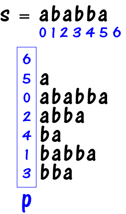
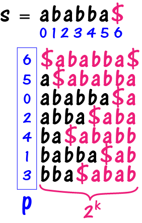
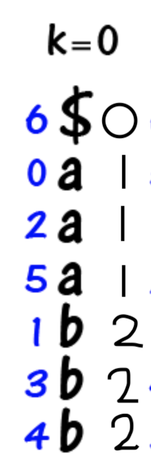
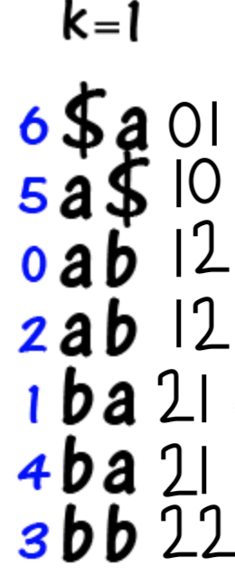
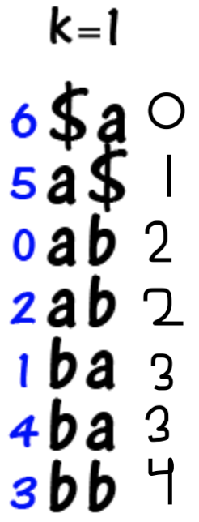
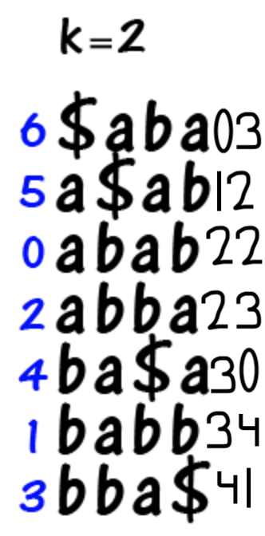
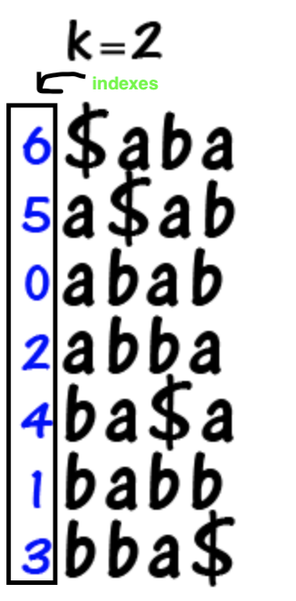

# Suffix Array

## About

A suffix array is a sorted array of all the suffixes of any given string. The indexes of the sorted array is called the *suffix array*.

## The Idea

Let's say we have a string S that is "ababba". To start, we'll write all the suffixes in lexicographical order.

This sequence of strings can be stored in an array. But there's a problem: Storing the strings in a array take up O(n2) space. This is where an suffix array comes in handy.

To start, we need an empty string, as that is also considered a substring of string S.

Now, before we actually use the algorithm, we need to preprocess our string. At the end of every string, we add $ symbol (as $ is less than all of the characters in ASCII).

The second prepartion we need is to make the strings in the same length. The length we want is 2k, where k is the smallest possible value. For the string S, the smallest k value is 3, so we make the strings 2k = 8. Because the string is circular, if there is no more characters remaining at the end of the string, we go the beginning of the string.

Okay! Now our string is in a workable format, we can finally use the algorithm.

## The Algorithm

### Finding k
Once we have found k, we can iterate from 0 ... k.

### k = 0
At the beginning, k = 0 is an edge case as we only get the first character of each of the suffixes (including the "$"), and we sort it.

After sorting, we assign weights starting from 0.

### k = 1

In the next case, when k = 1, we take the first two characters and instead of writing the characters, we write the weights from the previous k = 0 iteration.

Now for the weights:

### k = 2

Now for the final iteration.

### Printing the Results

Remember the indexes during each iteration? Well, after the final iteration (k = 2), we can print the indexes (as it has been sorted lexigraphically).

### Implementing the Algorithm

See the code by clicking [here](a_suffix_array.cpp).
